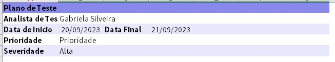
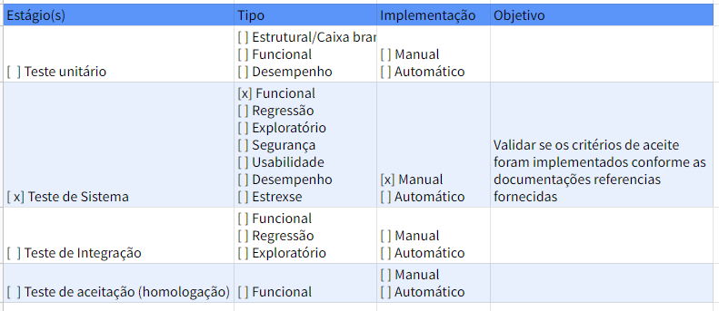
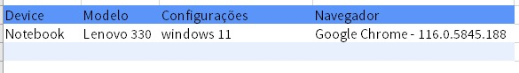
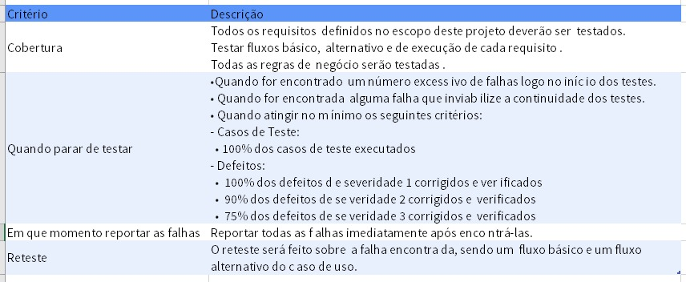
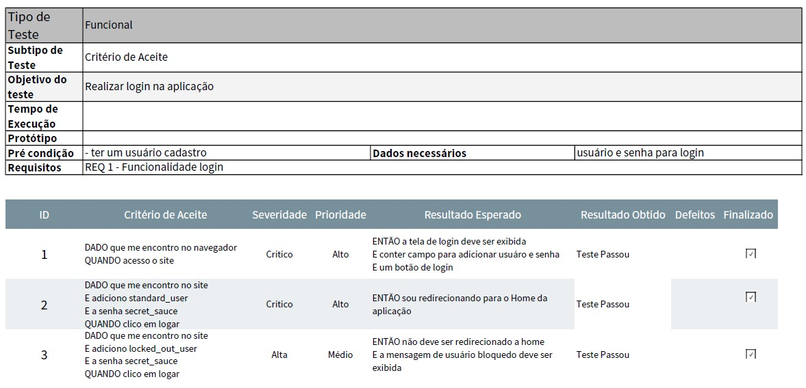

## Projeto Plano de Teste
---
Este projeto foi criado com o propósito de práticar a criação e execução do Plano de Teste de um projeto. Onde foi levado em consideração analisar um site já existente, realizar levantamento dos seus requisitos, criação de suites e casos de teste para execução.

### Ferramentas
- Site utilizado para elaboração do Plano [Saucedemo](https://www.saucedemo.com/).
- Excell para criação do Plano de Teste.

### Apresentação do Plano:
Na aba Introdução da Planilha irá conter todas as informações bases do projeto.

### Estratégia de Teste:
Na aba Estratégia de Teste irá conter informações sobre como será a abordagem e execução dos testes.

### Ambiente de Teste:
Na aba Ambiente de Teste irá conter as definições dos dispositivos e configurações das quais foram realizadas os testes.

### Critério de Aceite:
Na aba Critério de Aceite irá conter informações sobre a cobertura dos teste, Quando parar de testar, Quando reportar falhas e Quando será necessário fazer um Reteste.

### Apresentando a Suite:
Na aba Suite_(nome do requisito) irá conter todas as informações necessárias para execução dos testes vinculadas a Suíte.

Entre eles:

- Objetivo do teste;
- Tempo de execução;
- Protótipo;
- Pré condicação;
- Dados necessário;
- Critério de aceite;
- Requisitos;
- Casos de teste;
- Prioridade;
- Severidade.

